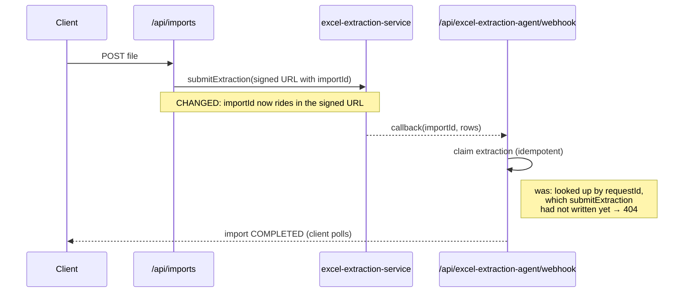
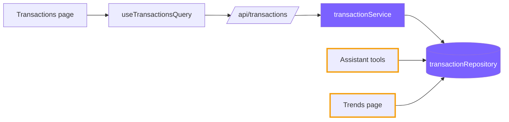

# Writing a PR description

Every PR body in this repository has the same three sections, in this order:
**Motivation**, **Implementation**, **Proof of Work**. Consistency is the
point — a reviewer opening any PR knows where to find why it exists, where
the change lives, and the evidence it works. A **Visualization** goes between
the second and third when the change has a shape worth drawing.

The animating idea: the reviewer will read the diff. The description carries
what the diff cannot — the reason, the map, and the proof.

Write for someone deciding, in thirty seconds, how much of their attention
this deserves. They should finish Motivation knowing why it exists and how
much is at stake, finish Implementation knowing where to look, and be able
to stop there. Everything below that point is for the reader who chose to go
deeper. That is the difference between a description and a wall of text: not
length, but whether the important part comes first and the rest is optional.

## Gather the facts first — never write from memory of the task

The value of these descriptions is that everything in them is observed.

```bash
git log --oneline main..HEAD          # the commits
git diff main...HEAD --stat            # the real shape of the change
git diff main...HEAD                   # read it — you will find things you forgot
```

Then produce the actual proof. **Read the `proof-of-work` skill and follow
it** — it covers bringing the stack up locally, exercising endpoints, and
capturing screenshots with Playwright. Do that before drafting, so the
Proof of Work section is a transcript rather than a promise.

Check whether the branch relates to earlier work. A cross-reference like
"Companion to #48" or "Third of three fixes from the audit that followed
#39" belongs in the first line of Motivation.

## Title

Sentence case, no prefix, no ticket number, no `feat:`/`fix:`. State the
outcome as a change to the product or the codebase:

- `Let users edit detected subscriptions and see why they were detected`
- `Drill into a pie slice to see its transactions`
- `Render all money through one ILS formatter`
- `Fix transactions list 400 by paginating within the perPage cap`

Prefer the user-visible effect over the mechanism when both fit. A pure
refactor names the shape it moved to, not the effort spent
(`Read the comparison series bound from one constant`, not
`Refactor trends constants`).

## 1. Motivation

Two to three lines. Not a paragraph, and not a restatement of the title.
Say what was wrong or missing and why it was worth fixing — the state of the
world the change lands in.

A good Motivation makes the reader want the change before they know what it
is. Concrete beats abstract: describe the old behaviour precisely enough
that it feels wrong.

```markdown
## Motivation

Someone with four credit cards runs the entire Imports flow four times: open
the dialog, drop one file, wait for the upload and the extraction submit, let
the dialog close, reopen it, repeat. The dropzone was capped at one file and
started the request on drop, which is also why the payment month had to be
typed before dropping.
```

```markdown
## Motivation

Third of three fixes from the client/schema mismatch audit that followed #39.
The subscriptions page showed a `$` on its amounts — the only place in the app
doing so — because the feature built its strings with template literals instead
of the shared formatter. Pulling that thread found four independent definitions
of "money is ILS" that had drifted apart.
```

When the stakes are not obvious from the symptom, close Motivation with one
line naming them. This is what lets a reviewer triage the PR before reading
any of it — and a bug that looks trivial often is not:

> Only one announcement ships today, so nothing breaks right now — it starts
> failing at the 51st, and it fails **silently**: the dialog closes
> optimistically, so a systematic 400 surfaces as "What's new" reappearing on
> every load, forever, with nothing pointing at the cause.

That works in the other direction too. A change that looks alarming and is not
should say so ("byte-identical output except the two trends cards"), so nobody
reviews it as though it were risky.

Do not open with "This PR adds…" or "This pull request implements…".

## 2. Implementation

The map of the change — where it lives and what each part now does, so a
reviewer can decide what to open first. One sentence per entry, path in
backticks.

**Aim for three to six bullets. Eight is the ceiling.** This is the rule that
keeps a description at eye level, and the one most likely to be broken: half
the merged PRs in this repo touch 15+ non-test files, and #38 touched 52. A
bullet per file turns the map back into the diff and buries the two entries
that actually matter.

So the unit is the **area**, not the file. Above a handful of files, name the
module or the pattern and give the count:

> - `src/components/**` and `src/server/services/**` — 12 call sites move off
>   local formatters onto `formatCurrency`; byte-identical output except the
>   two trends cards, which had the symbol on the wrong side.

Pick entries by what a reviewer must understand, not by diff size. A 200-line
generated migration can be half a bullet; a four-line change to auth is its own.

**Implementation covers the headline change only.** Fixes you made along the
way that are not what the PR is for go in `## Also fixed` and do not spend the
budget here — otherwise three drive-by fixes crowd out the map of the thing
the PR is actually about. This is easy to get wrong: #50 shipped a signup
security fix, an export bound and an error-message fix alongside a pie-chart
drill-down, and all three belong below, not in the map.

**Skip test files.** Their content belongs in Proof of Work, and listing them
adds length without telling the reviewer anything they cannot see.

Group under a bold sub-label when the change spans distinct areas, so the
shape is visible before any of it is read:

```markdown
## Implementation

**Client** — the whole change, the model already supported it

- `src/components/FileUpload/` — files queue as rows with their own payment
  month; an explicit "Upload N files" starts the batch instead of uploading
  on drop.
- `src/utils/importUploadRunner.ts` + `asyncPool.ts` — runs two files at a
  time, because unbounded uploads split one uplink N ways against the 120s
  timeout and turn a slow batch into N failures.
- `src/hooks/useImports.ts` — polls while any import is in flight, bounded by
  how long this client has been watching.

**Server** — hardening the races that going parallel makes likely

- `src/server/webhooks/excelExtractionWebhook.ts` — the import id now rides in
  the signed URL, so a fast callback can no longer 404 against a request id
  that has not been written yet.
- `src/server/services/importService.ts` — merges go strictly oldest-wards and
  only into a `COMPLETED` import, so two racing callbacks cannot delete each
  other.
- `prisma/migrations/…_import_extraction_concurrency/` — `extractionCompletedAt`
  plus a unique index on `excelExtractionRequestId`, backfilled so a late
  redelivery cannot reprocess a finished import.
```

That is PR #46: 28 non-test files, six bullets. The sub-labels carry the
judgement — "the model already supported it", "hardening the races that going
parallel makes likely" — so the reviewer knows the stakes of each half before
reading a single path.

If an entry needs more than a sentence — a contested decision, a mechanism
with a non-obvious reason — keep the bullet short and expand it in an optional
section below. Implementation stays scannable.

## Visualization — when the change has a shape

Between Implementation and Proof of Work, add a diagram when the change is
**architectural, asynchronous, or crosses component boundaries**. Prose is bad
at conveying blast radius; a picture answers "how much of the system does this
touch, and how badly does it hurt if it is wrong" before the reviewer opens a
file.

GitHub renders Mermaid in PR bodies, so the diagram lives in the description
itself — no image to commit, and it stays readable in both themes.

**Add one when:**

- A request crosses a service boundary or comes back asynchronously — webhooks,
  callbacks, SSE, cron, anything where the order of arrival is the risk.
- The change moves a responsibility between layers, or introduces a new one.
- Several components are affected and the reviewer would otherwise have to
  reconstruct the flow from the file list.
- Concurrency changes: something that ran once now runs N times in parallel.

**Skip it when** the change is local — a validation rule, a formatter, a
component's props. A diagram of a two-file fix is the same slop as a
twenty-bullet Implementation.

### Async flows — sequence diagram

Show the ordering, and mark what this PR changed. The point is the race, not
the happy path:

````markdown

````

`Note` is doing the real work here — it marks the edit and states the failure
it removes. A sequence diagram that only shows the new happy path tells the
reviewer nothing about why the PR exists.

### Blast radius — flowchart

When the question is _what else is affected_, draw the components and
highlight the touched ones:

````markdown

````

Filled = changed by this PR. Outlined = **not** changed but reading the same
code, so a reviewer sees immediately that the assistant and the trends page
inherit the new behaviour. That second category is the one worth drawing —
it is how a "small" repository change turns out to be critical.

Caption every diagram with one line of prose saying what to take from it.
Keep it to a dozen nodes; past that it stops being a glance.

## 3. Proof of Work

Evidence the change does what it says, produced by running it. The
`proof-of-work` skill covers how to generate this; what belongs here is the
result:

- **Backend changes** — the service run locally against a real Postgres, the
  relevant endpoint or flow called, and the actual request/response pasted in
  a fenced block. Include the failing case too when the PR fixes a bug: the
  old error and the new success.
- **UI changes** — Playwright screenshots committed under `docs/proof-of-work/`
  and embedded, desktop and mobile, plus dark mode when the change touches
  anything visual.
- **Always** — the check results with real numbers:

```markdown
- `npm test` — 315/315
- `npm run typecheck` — clean
- `npm run lint` — 0 errors (25 warnings, all pre-existing in `src/server/services/`)
```

Say what you did _not_ verify when that is true of anything meaningful — a
screen that was typechecked but never clicked through, a path only covered by
a unit test. That honesty is what makes the rest of the section credible.

## Optional sections, after the three

Add these only when the change genuinely calls for one. They come after
Proof of Work. Every one of them appears in this repo's merged PRs.

The exception is `## ⚠️ Behavior change worth a look`, which goes **directly
after Motivation** when the behaviour change is the main risk of the PR. A
reviewer triaging top-down has to meet the loudest warning early; burying it
below the proof defeats the point of having it.

| Section                              | Use it when                                                                                                      |
| ------------------------------------ | ---------------------------------------------------------------------------------------------------------------- |
| `## ⚠️ Behavior change worth a look` | Behaviour changes beyond what the title promises — always call this out loudly                                   |
| `## A note on the alternative`       | You rejected a real alternative; name it, say why it loses, and invite the counter-argument                      |
| `## Why it wasn't caught`            | A bug reached main — say what in the tests or types let it through, and whether this PR closes that gap          |
| `## Also fixed`                      | Things fixed along the way that are not the headline change                                                      |
| `## Deliberately not done here`      | You consciously stopped somewhere, so the omission reads as a decision                                           |
| `## Deployment notes`                | A new env var, a migration that must run first, an ordering constraint, or a webhook to re-register              |
| `## Notes for the reviewer`          | Anything that fits nowhere else — including why the diff is noisier than the change (a prettier sweep, a rebase) |

The defended alternative is the one most worth writing. From #40:

> Relaxing the schema instead would be a smaller diff, but it would make
> clearing a category a **silent no-op**: Prisma reads `undefined` as "leave
> unchanged", so the old category would survive while the UI implied AI had
> picked a new one. … Happy to switch if you'd rather have the endpoint accept
> clearing.

A reviewer can overrule that in one comment instead of discovering it in the
diff.

`## Deployment notes` is the one most often forgotten, and the only one whose
absence can break production rather than just the review: if this PR needs
something done outside the deploy, it belongs here.

## Voice

Plain declarative prose, specific figures, no salesmanship. Write as a
careful engineer explaining their reasoning to a peer who is about to
disagree.

- **Backtick every identifier, use full paths** — `src/server/services/importService.ts`,
  `handleCompletedExtraction`. A reviewer should be able to jump straight to it.
- **Show the artifact, don't describe it** — paste the real error text, the
  two snippets that disagree, the rendered output. A table when several
  things drifted apart.
- **Explain the mechanism, not just the outcome** — "Two upload at a time:
  sequential is as slow as today, and unbounded splits one uplink N ways
  against a 120s wall-clock upload timeout, turning a slow batch into N
  failures."
- **State the limits** — "Rows detected before this change have no evidence
  stored; the dialog says so rather than inventing a reason retroactively."
- No emoji except the ⚠️ marker, no marketing language.

## Length

Match the change. A one-file fix: Motivation of two lines, two or three
Implementation bullets, a short Proof of Work — around 1,000 characters, no
diagram. A substantial feature runs 4,000–8,000 with grouped Implementation
bullets, a diagram if it has a shape, screenshots, and two or three optional
sections.

The failure mode to watch is not brevity, it is bulk that looks like rigour:
a bullet per file, a paragraph restating the diff, a diagram of something
local. A reviewer should get the whole picture from the first screen and
choose to read further, rather than having to.

## Footer

End the body with the attribution footer, after a rule:

```markdown
---

_Generated by [Claude Code](https://claude.ai/code)_
```

The tooling may append this and strips duplicates, so include it and do not
worry about it appearing twice. Never put a model name, `Co-Authored-By`, or
a session ID in the body.

## Before you post

- Does Motivation make me want the change, in three lines, without the title?
- Can I tell how critical this is without opening a file?
- Is Implementation eight bullets or fewer, and can I open the files that
  matter from it?
- If the change is async or crosses components, is there a diagram — and does
  it mark what changed rather than just drawing the happy path?
- Is the Proof of Work something I actually ran, with real numbers?
- Is there a sentence the diff already tells me? Cut it.
- If this changes something beyond what the title promises, is that loud?
- Does anything need doing at deploy time that is not in the body?

## Worked example

`references/example.md` holds a complete body in this structure, annotated
with what each section is doing. Read it when you want a full-shape model.
