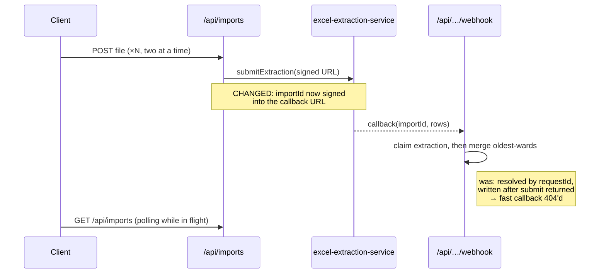

# Worked examples

Two complete bodies in the required structure. Both are adapted from real
merged PRs in this repository (#40 and #46) — the substance is real, recast
into the Motivation / Implementation / Proof of Work shape.

Read the annotation, then read the body and watch it happen.

---

## Example 1 — a fix (~1,800 characters)

Small change, small body. Motivation gives the origin and the symptom in
three lines. Implementation is three bullets, no grouping needed, no test
files. Proof of Work shows the endpoint failing the old way and succeeding
the new way — the pair is what makes it proof rather than assertion. The
optional section at the end names the smaller diff that was available and why
it loses, so the reviewer can overrule it in one comment.

**Title:** `Require a category when editing a transaction`

<details>
<summary>Full body</summary>

## Motivation

Second of three fixes from the client/schema mismatch audit that followed #39.
`createTransactionSchema` makes `categoryId` optional while
`updateTransactionSchema` requires it, and `TransactionForm` treats both modes
the same — so clearing the category on an edit sent `categoryId: undefined` and
the PUT failed validation. The form actively invited it, rendering "If category
is not filled, it will be generated by AI" while editing.

## Implementation

- `src/components/transactions/TransactionForm.tsx` — requires a category when
  editing, matching what `ScheduledTransactionForm` already does for the same
  constraint, and limits the AI hint to creates.
- `src/utils/transactionFormValidation.ts` — validation moves to a pure helper
  so the create/edit rule is testable without a DOM.

## Proof of Work

App running locally against `prisma dev`, driven through the real endpoint.

**Before** — clearing the category on an edit:

```
PUT /api/transactions/8f3a... -> 400
[{ "code":"invalid_type", "received":"undefined", "path":["categoryId"], "message":"Required" }]
```

**After** — the form blocks submission with "Category is required", and a PUT
carrying a category succeeds:

```
PUT /api/transactions/8f3a... -> 200
{"id":"8f3a...","categoryId":"c21e...","value":89.9}
```

Creating without a category still works and is still filled in by AI —
verified with a `POST /api/transactions` omitting `categoryId`, which returned
a transaction with `categoryId` set.

- `npm test` — 115 passed
- `npm run typecheck` and `npm run lint` — clean

## A note on the alternative

`transactionService.updateTransaction` already takes `CreateTransactionRequest`
and guards `if (data.categoryId)`, so the service tolerates an absent category —
only the schema rejects it.

Relaxing the schema instead would be a smaller diff, but it would make clearing
a category a **silent no-op**: Prisma reads `undefined` as "leave unchanged", so
the old category would survive while the UI implied AI had picked a new one.
Making that gesture actually re-run AI categorization is real feature work, so
this PR keeps the API contract and makes the client honest about it. Happy to
switch if you'd rather have the endpoint accept clearing.

</details>

---

## Example 2 — a feature with an async flow (~3,400 characters)

The change touches 28 non-test files and Implementation is six bullets. The
sub-labels do the triage: "the model already supported it" tells the reviewer
the client half is low-risk, "hardening the races that going parallel makes
likely" tells them the server half is not.

Motivation describes the old flow as a sequence of physical steps, so the cost
is felt before a solution is proposed. The diagram earns its place because the
risk is an ordering problem — the `Note` marks what changed and names the
failure it removes, which prose would take a paragraph to do worse. Proof of
Work carries both kinds of evidence, and the scope fence at the end makes the
omission read as a decision rather than an oversight.

**Title:** `Import several statement files in one pass`

<details>
<summary>Full body</summary>

## Motivation

Someone with four credit cards runs the entire Imports flow four times: open the
dialog, drop one file, wait for the upload and the extraction submit, let the
dialog close, reopen it, repeat. Uploading a file already created exactly one
import, so the data model was right — only the client was single-file.

## Implementation

**Client** — the whole feature; the model already supported it, since
`processImport` always created exactly one `Import` per call

- `src/components/FileUpload/` — files queue as rows with their own payment
  month (plus "Apply to all"), and an explicit "Upload N files" starts the
  batch instead of uploading on drop.
- `src/utils/importUploadRunner.ts` + `asyncPool.ts` — two files at a time:
  sequential is as slow as today, and unbounded splits one uplink N ways
  against the 120s upload timeout, turning a slow batch into N failures.
- `src/hooks/useImports.ts` — polls while any import is in flight, bounded by
  how long this client has been watching, so a skewed clock cannot disable it.

**Server** — hardening the races that running four extractions at once
promotes from latent to likely

- `src/server/webhooks/excelExtractionWebhook.ts` — the import id now rides in
  the signed URL, so a fast callback no longer 404s against a request id
  `submitExtraction` has not written yet.
- `src/server/services/importService.ts` — merges go strictly oldest-wards and
  only into a `COMPLETED` import, so two callbacks for the same card and month
  cannot each treat the other as the duplicate and both delete themselves.
- `prisma/migrations/…_import_extraction_concurrency/` — `extractionCompletedAt`
  plus a unique index on `excelExtractionRequestId`, backfilled so a late
  redelivery cannot reprocess a finished import.

## Visualization



The two `Note` lines are the whole review: everything else was already true.

## Proof of Work

**Backend.** Stack up locally (`npx prisma dev`, `npx tsx test/e2e-api/serve.ts`),
four files submitted, and the mock extraction agent calling back _after_
responding so the callback races the request-id write:

```
POST /api/imports (4 files)     -> 4 × 201, imports 3f1a 7c22 91b0 c4d8
GET  /api/imports               -> 4 × PROCESSING
[callback 7c22] 200  imported 42 transactions
[callback 3f1a] 200  imported 17 transactions
[callback c4d8] 200  imported 8  transactions
[callback 91b0] 200  imported 31 transactions
GET  /api/imports               -> 4 × COMPLETED, 98 rows total
```

Redelivering the `7c22` callback returned 200 with no new rows, and a tampered
import id in the signed URL returned 401.

**UI.**

| Desktop                                                                                                                                               | Mobile                                                                                                                                               |
| ----------------------------------------------------------------------------------------------------------------------------------------------------- | ---------------------------------------------------------------------------------------------------------------------------------------------------- |
| /import-several-files/import-queue-desktop.png" width="600"/> | /import-several-files/import-queue-mobile.png" width="250"/> |

The queue with four rows mid-batch, one row failed and offering Retry.

- `npm test` — 268 passed, up from 193
- `npm run test:e2e:ui` — 13/13, `npm run test:e2e:api` — 46/46
- `npm run typecheck` and `npm run lint` — clean

## Deliberately not done here

Matching went from `Promise.all` to a sequential loop to make the exclusion set
meaningful, and it is awaited inside the webhook handler. For a large statement
that is N × (DB + one LLM call), which can outlast the serverless timeout. The
fix is to cluster disjoint rows or move matching off the response path — a
redesign worth its own issue rather than a bolt-on here.

</details>
